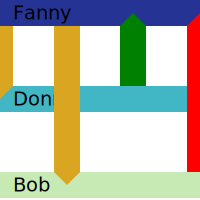

# ladder

A [D3](https://d3js.org/) component for generating dynamic ladder diagrams. 



Time proceeds to the right and sources are separated vertically. `Sources` are represented by labeled horizontal bars. `Events` are represented as vertical rungs in between the bars of the two participating sources.

Ladder diagrams are useful for showing a sequence of messages between actors over time, such as UML interaction diagrams or network logs. Here is an example of a short script which generates a diagram much like the above image;

``` Javascript
    let pop = createReadout();
    let svg = d3.selectAll('svg');
    let lad = createLadder( svg, 0, 0, 256, 256, pop)
        .sources( [
            {id:'Fanny' class:'supervisor'},
            {id:'Donna' class:'subordinate'},
            {id:'Bob' class:'subordinate'} ] )
        .events( [
            {time:0, source:'Fanny', target:'Donna', class:'request'},
            {time:85, source:'Fanny', target:'Bob', class:'request'},
            {time:170, source:'Donna', target:'Fanny', class:'affirmative'},
            {time:256, source:'Bob', target:'Fanny', class:'negative'} ] )
        .interval( 256 );
    lad();

```

The `class` member of source and event objects is applied as the CSS class of the corresponding svg objects. Use these classes to style your Ladder diagrams.

There is also some interactivity; use the mouse wheel over source labels to change the ration of negative space. I'm currently working on making the sources draggable to reorder them.

The diagram can be dynamically updated with new data by invoking the ladder method on modified datasets. More examples can be found on the project [page](https://caseyshields.github.io/ladder/)

---

## Ladder API


### createLadder( svg, id, left, top, width, height, readout )

*Creates a ladder object and linkes it to the given readout object. This object is also a function which can be used to render the current dataset.*

Parameter|Type|Description
---|---|---
svg|D3 Selector|A selector holding the SVG element to add the ladder diagram to
id|String|An internal id for the diagram
left|Integer|X coordinate for top left corner of diagram
top|Integer|Y coordinate for top left corner of diagram
width|Integer|Width of diagram
height|Integer|Height
readout|Readout object| Optional. A component which will display context information on mouse over

### sources( source[] )

*Sets the sources displayed on the ladder diagram. These take the form of labled, horizontal lines.*

Parameter|Type|Description
-|-|-
source[n].id|string|The name of the source, shown on the label and used by events to reference the source
source[n].class|string|The CSS class applied to the SVG group tag holding the source representation.

### events( event[] )

*Sets the events displayed on the ladder diagrams. These take the form of arrows between the two relevant sources.*

Parameter|Type|Description
-|-|-
event[n].time|integer|an integer holding some count
event[n].source|string|Id of the originating source
event[n].target|string|Id of the destination source
event[n].class|string|name of the css class to apply to the SVG group representing the effect

### interval( i )

### currentTime( t )

### add( event )

---

## Future Plans

 - [ ] Make the sources re-orderable in an efficient manner
 - [ ] Add brushes for modifing the time axis
 - [ ] Add the ability to collapse sources into groups...